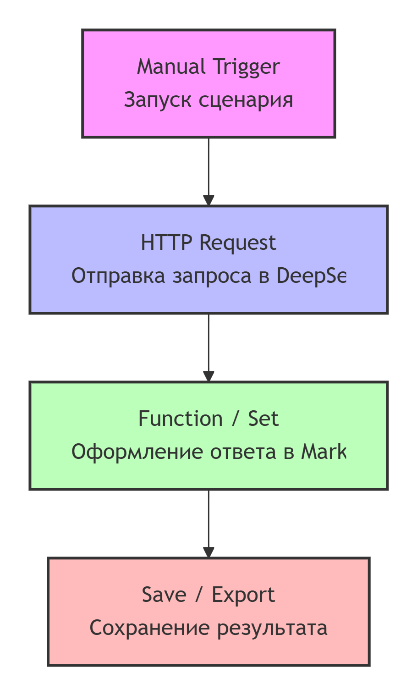
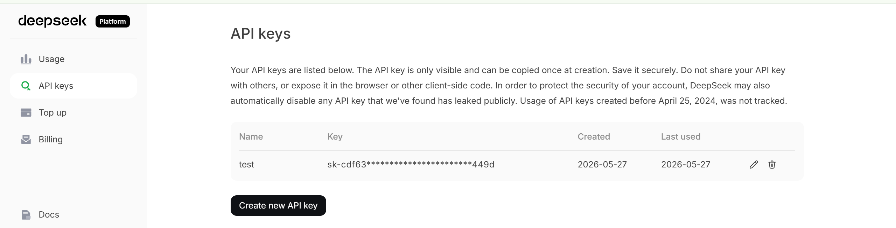
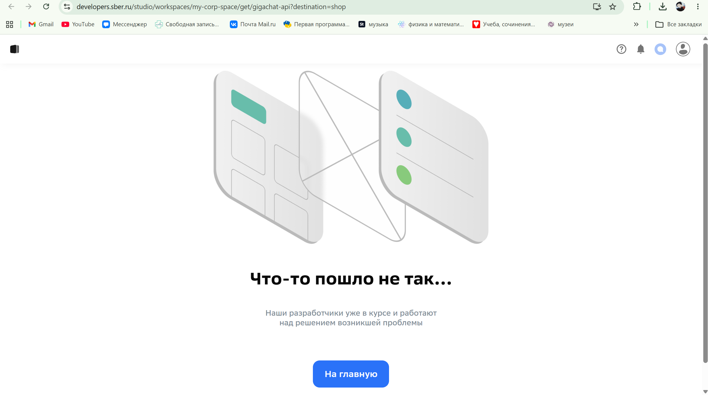
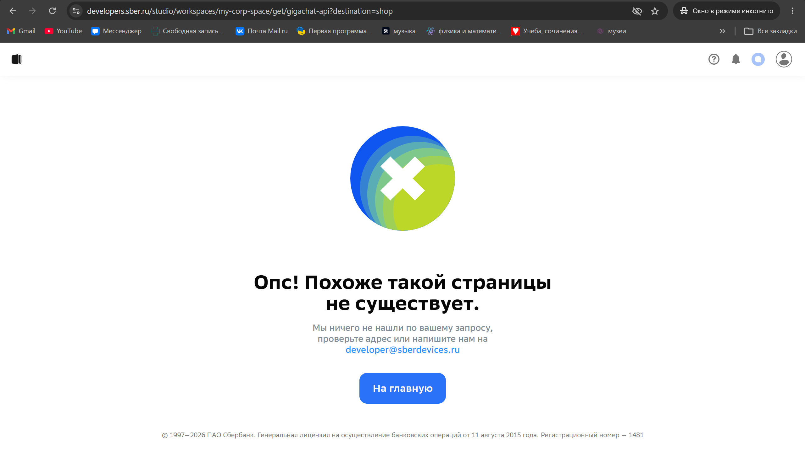

# Реферат

## **Тема:** Интеграционные платформы для подключения облачных больших языковых моделей в образовательных процессах 

## Содержание

1. [Введение](#введение)
2. [Роль больших языковых моделей в современном образовании](#роль-больших-языковых-моделей-в-современном-образовании)
3. [Что такое интеграционная платформа](#что-такое-интеграционная-платформа)
4. [Критерии сравнения платформ](#критерии-сравнения-платформ)
5. [Платформа n8n](#платформа-n8n)
6. [Платформа Dify](#платформа-dify)
7. [Платформа Flowise](#платформа-flowise)
8. [Сравнительный анализ платформ](#сравнительный-анализ-платформ)
9. [Обзор российских и китайских больших языковых моделей](#обзор-российских-и-китайских-больших-языковых-моделей)
10. [Применение LLM для автоматизации образовательных процессов](#применение-llm-для-автоматизации-образовательных-процессов)
11. [Практическая часть: попытка реализации автоматизации и возникшие ограничения](#практическая-часть-попытка-реализации-автоматизации-и-возникшие-ограничения)
12. [Риски и ограничения использования LLM в образовании](#риски-и-ограничения-использования-llm-в-образовании)
13. [Вывод](#вывод)
14. [Список источников](#список-источников)

---

## Введение

Цифровизация образования постепенно меняет способы организации учебного процесса. Если раньше автоматизация в основном касалась электронных журналов, расписания, дистанционных курсов и тестирования, то сейчас всё больше внимания уделяется использованию искусственного интеллекта. Особенно заметную роль начинают играть большие языковые модели, которые могут работать с текстом, отвечать на вопросы, составлять задания, объяснять материал и помогать преподавателю в рутинных задачах.

Большие языковые модели, или LLM, не являются полноценной заменой преподавателя. Однако они могут быть полезным вспомогательным инструментом. Например, модель может помочь составить вопросы по теме занятия, подготовить краткое объяснение сложного понятия, проверить черновик ответа студента или предложить рекомендации по улучшению текста.

При этом важно понимать, что сама языковая модель не решает задачу автоматизации полностью. Чтобы использовать её в образовательном процессе, необходимо связать модель с другими инструментами. Это может быть форма для ввода ответа студента, таблица с результатами, чат-бот, система дистанционного обучения, электронная почта или база учебных материалов.

Для такой связи используются интеграционные платформы. Они помогают объединять разные сервисы и создавать последовательность действий без полноценной разработки сложной программы с нуля. Визуальные платформы позволяют настроить процесс: получить данные, передать их в LLM, обработать ответ и сохранить результат.

В данном реферате рассматриваются три платформы, которые можно использовать для интеграции больших языковых моделей:

- n8n;
- Dify;
- Flowise.

Особое внимание уделяется возможности подключения российских и китайских моделей, таких как GigaChat, YandexGPT, DeepSeek и Qwen. Также рассматривается пример простой автоматизации образовательной задачи с помощью DeepSeek API.

---

## Роль больших языковых моделей в современном образовании

Большие языковые модели представляют собой программные системы, которые обучены на больших массивах текстовой информации. Они способны понимать запросы на естественном языке и создавать ответы, похожие на человеческие. Такие модели могут использоваться в образовании для разных задач.

Во-первых, LLM могут помогать преподавателю при подготовке учебных материалов. Например, преподаватель задаёт тему, а модель предлагает план занятия, список вопросов, краткий конспект или примеры для объяснения. Это особенно удобно, когда нужно быстро подготовить черновик материала.

Во-вторых, модели могут использоваться для создания тренировочных заданий. Например, по теме занятия можно автоматически сформировать тест, вопросы для самопроверки, карточки с терминами или небольшие практические задания.

В-третьих, LLM могут помогать с обратной связью. Если студент написал ответ, модель может выделить сильные стороны, указать, что стоит дополнить, и предложить более точную формулировку. Такой подход может снизить нагрузку на преподавателя, особенно если нужно быстро просмотреть большое количество однотипных работ.

В-четвёртых, большие языковые модели могут применяться в образовательных чат-ботах. Такой чат-бот может отвечать на вопросы студентов по материалам курса, объяснять термины, помогать с подготовкой к зачёту или экзамену.

Однако при использовании LLM важно сохранять контроль преподавателя. Модель может ошибаться, давать неточные сведения или формулировать слишком общие ответы. Поэтому её результаты следует рассматривать как черновые материалы, которые требуют проверки.

---

## Что такое интеграционная платформа

Интеграционная платформа — это инструмент, который позволяет соединять разные программы, сервисы и API между собой. Она помогает передавать данные из одного сервиса в другой и автоматизировать цепочку действий.

Например, если студент отправляет ответ через форму, интеграционная платформа может:

1. Получить этот ответ.
2. Отправить его в API языковой модели.
3. Получить комментарий от модели.
4. Записать результат в таблицу.
5. Отправить уведомление преподавателю.

Такая автоматизация может быть небольшой, но она уже экономит время и делает процесс более удобным. В образовательной среде это особенно важно, потому что многие процессы повторяются: проверка однотипных ответов, подготовка заданий, отправка уведомлений, сбор обратной связи, формирование кратких отчётов.

Интеграционные платформы могут быть универсальными или специализированными. Универсальные платформы, например n8n, подходят для связи разных сервисов. Специализированные платформы, например Dify и Flowise, больше ориентированы на создание приложений и цепочек, связанных с искусственным интеллектом.

---

## Критерии сравнения платформ

Для сравнения платформ были выбраны критерии, которые важны для образовательных задач.

### Простота использования

Платформа должна быть понятной для пользователя, который не является профессиональным разработчиком. В учебной работе важно, чтобы студент или преподаватель мог настроить простой сценарий по инструкции.

### Поддержка API

Большинство облачных больших языковых моделей подключаются через API. Поэтому платформа должна уметь отправлять HTTP-запросы, передавать заголовки, работать с JSON и обрабатывать ответы.

### Возможность подключения разных моделей

Важно, чтобы платформа не ограничивалась только одной моделью. Для учебных и практических задач полезно иметь возможность подключать DeepSeek, GigaChat, YandexGPT, Qwen и другие модели.

### Наличие визуального интерфейса

Визуальный интерфейс помогает лучше понять логику автоматизации. Для учебной работы это особенно удобно, потому что можно показать схему процесса на скриншоте.

### Возможность работы с базой знаний

Для образовательных помощников важно, чтобы модель могла отвечать не только на основе общих знаний, но и с опорой на конкретные учебные материалы. Для этого используется подход RAG, то есть генерация ответа с предварительным поиском по базе знаний.

### Безопасность

При работе с учебными данными необходимо учитывать безопасность. Нельзя публиковать API-ключи, передавать персональные данные без необходимости и полностью доверять модели при оценивании.

---

## Платформа n8n

n8n — это платформа для автоматизации рабочих процессов. Она позволяет создавать сценарии из отдельных блоков. Каждый блок выполняет своё действие: запускает процесс, получает данные, отправляет запрос, преобразует информацию или передаёт результат дальше.

n8n можно использовать не только для искусственного интеллекта. Это универсальная платформа, которая подходит для интеграции таблиц, форм, почты,

баз данных, мессенджеров, сайтов и внешних API. Но благодаря поддержке HTTP-запросов и AI-блоков её можно использовать и для работы с большими языковыми моделями.

Для образовательной автоматизации n8n удобен тем, что позволяет быстро собрать цепочку действий. Например, преподаватель может настроить сценарий, в котором тема занятия отправляется в LLM, а в ответ автоматически создаются вопросы для самопроверки. Также можно настроить обработку ответов студентов: студент отправляет ответ, модель формирует комментарий, а результат сохраняется в таблицу.

Главное преимущество n8n заключается в гибкости. Даже если нужной модели нет среди готовых интеграций, её можно подключить через HTTP Request. Это позволяет работать с DeepSeek API, GigaChat API, YandexGPT и другими сервисами.

### Преимущества n8n

- удобная визуальная схема автоматизации;
- большое количество интеграций;
- возможность отправлять HTTP-запросы;
- подходит для связи LLM с таблицами, формами и почтой;
- можно использовать для учебных и практических задач;
- поддерживает сценарии с разными источниками данных.

### Недостатки n8n

- для настройки API нужны базовые технические знания;
- сложные AI-приложения могут быть труднее в реализации;
- необходимо аккуратно работать с ключами доступа;
- для RAG-сценариев может потребоваться дополнительная настройка;
- использование может быть затратно.

### Пример образовательного использования n8n

Преподаватель может создать автоматизацию, которая получает тему занятия и отправляет её в DeepSeek API. Модель возвращает список из пяти вопросов и критерии оценивания. Полученный результат можно сохранить в Markdown-файл или таблицу.

---

## Платформа Dify

Dify — это платформа для создания приложений на основе больших языковых моделей. Она больше ориентирована именно на LLM-приложения, чем на обычную автоматизацию. В Dify можно создавать чат-ботов, workflows, агентов, базы знаний и приложения с использованием разных моделей.

Для образования Dify интересен тем, что позволяет создавать учебных помощников. Например, преподаватель может загрузить в систему материалы курса: лекции, презентации, инструкции, методические рекомендации. После этого студент сможет задавать вопросы, а модель будет отвечать с опорой на эти материалы.

Такой подход называется RAG. Он помогает сделать ответы более связанными с конкретным курсом. Это важно, потому что обычная языковая модель может отвечать слишком обобщённо, а помощник с базой знаний использует именно загруженные учебные документы.

Dify также удобен для создания приложений, где нужно управлять промптами, выбирать модель, настраивать процесс обработки и смотреть результат. Платформа может использоваться как для учебных прототипов, так и для более серьёзных проектов.

### Преимущества Dify

- ориентирован на LLM-приложения;
- поддерживает workflows и AI-агентов;
- подходит для создания чат-ботов;
- поддерживает базы знаний и RAG;
- позволяет работать с разными моделями;
- удобен для создания образовательных AI-помощников.

### Недостатки Dify

- сложнее для обычных интеграций, чем n8n;
- требует понимания промптов и логики LLM-приложений;
- подключение некоторых моделей может потребовать дополнительной настройки;
- самостоятельное размещение требует технических навыков.

### Пример образовательного использования Dify

На основе Dify можно создать помощника по дисциплине. В него загружаются материалы курса, после чего студент может задавать вопросы. Модель отвечает на основе загруженных документов, а не только из общих знаний.

---

## Платформа Flowise

Flowise — это визуальная платформа для создания AI-агентов и LLM-workflows. Она позволяет собирать цепочки из блоков: модель, шаблон промпта, память, инструменты, база знаний, embeddings и другие компоненты.

Главное преимущество Flowise — наглядность. Пользователь видит, как устроена цепочка обработки запроса. Это удобно для учебных целей, потому что можно показать, как вопрос студента проходит через разные блоки и превращается в ответ модели.

Flowise подходит для создания чат-ботов, учебных помощников и RAG-приложений. Например, можно создать цепочку, где студент задаёт вопрос, система ищет нужный материал в базе знаний, затем передаёт его модели, а модель формирует ответ.

Также Flowise полезен для демонстрации принципов работы LLM-приложений. В учебной работе можно показать, как взаимодействуют модель, промпт, база знаний и итоговый ответ.

### Преимущества Flowise

- наглядная визуальная схема;
- подходит для демонстрации LLM-цепочек;
- можно создавать чат-ботов и агентов;
- поддерживает RAG-сценарии;
- удобен для учебных проектов;
- помогает понять архитектуру AI-приложений.

### Недостатки Flowise

- менее удобен для общей автоматизации, чем n8n;
- для сложных сценариев нужны знания архитектуры LLM;
- подключение нестандартных моделей может быть сложнее;
- для реального использования важна настройка безопасности.

### Пример образовательного использования Flowise

Flowise можно использовать для создания визуального чат-бота по учебному курсу. На схеме будет видно, как вопрос поступает в систему, как выбирается учебный материал и как формируется ответ.

---

## Сравнительный анализ платформ

| Критерий | n8n | Dify | Flowise |
|---|---|---|---|
| Основное назначение | Автоматизация процессов и интеграции | Создание LLM-приложений | Визуальная сборка LLM-цепочек |
| Удобство для новичка | Среднее | Среднее | Среднее |
| Визуальная настройка | Да | Да | Да |
| Работа с HTTP API | Очень удобная | Возможна | Возможна |
| Поддержка LLM | Да | Да | Да |
| Поддержка RAG | Возможна, но требует настройки | Да | Да |
| Подходит для чат-бота | Да, но не главная специализация | Да | Да |
| Подключение DeepSeek API | Удобно через HTTP Request | Возможно через провайдера или API | Возможно через совместимый endpoint |
| Подключение GigaChat API | Удобно через HTTP-запросы | Возможно через API или прокси | Возможно через инструмент или endpoint |
| Лучший сценарий | Связь разных сервисов | Учебный AI-помощник | Наглядная LLM-цепочка |

По итогам сравнения можно сделать вывод, что все три платформы подходят для образовательных задач, но каждая решает их немного по-разному. n8n лучше использовать, когда нужно автоматизировать действия между разными сервисами. Dify удобнее для создания полноценного учебного помощника. Flowise полезен, когда важно показать визуальную схему работы AI-приложения.

---

## Обзор российских и китайских больших языковых моделей

В рамках образовательных автоматизаций можно использовать разные облачные модели. Особенно интересны российские и китайские LLM, потому что они часто хорошо работают с русским языком или имеют удобные API.

### Российские модели

К российским решениям можно отнести:

- **GigaChat** — модель и API от Сбера;
- **YandexGPT** — модели Яндекса;
- другие корпоративные LLM, доступные через API.

Российские модели удобны для русскоязычного образовательного контента. Они могут использоваться для генерации заданий, проверки текстов, создания объяснений и подготовки учебных материалов.

### Китайские модели

К китайским моделям можно отнести:

- **DeepSeek**;
- **Qwen**;
- другие модели, доступные через облачные API.

DeepSeek удобен для интеграций, потому что его API можно использовать в OpenAI-совместимом формате. Это упрощает подключение к платформам, где уже есть поддержка похожих API.

### Значение для образовательных задач

Использование разных моделей позволяет сравнивать качество ответов, стоимость, скорость и удобство подключения. Для учебной работы это полезно, потому что показывает, что интеграция AI не зависит только от одного поставщика.

---

## Применение LLM для автоматизации образовательных процессов

Большие языковые модели могут автоматизировать не весь образовательный процесс, а отдельные небольшие задачи. Это делает их применение более безопасным и понятным.

### Генерация вопросов

Преподаватель вводит тему, а модель создаёт вопросы для повторения. Такой результат можно использовать как черновик теста.

### Краткая обратная связь

Модель анализирует короткий ответ студента и предлагает комментарий. Преподаватель может проверить комментарий и при необходимости исправить его.

### Подготовка конспекта

Если передать модели текст лекции, она может создать краткий конспект и выделить основные понятия.

### Классификация обращений

Если студенты задают вопросы через форму, модель может распределить их по категориям: технический вопрос, домашнее задание, оценка, расписание.

### Учебный чат-бот

На основе Dify или Flowise можно создать чат-бота, который отвечает на вопросы по материалам курса.

### Индивидуальные рекомендации

Модель может предложить студенту темы для повторения на основе ошибок в ответе.

---

## Практическая часть: попытка реализации автоматизации и возникшие ограничения

В рамках подготовки реферата была предпринята попытка практической реализации простой автоматизации для преподавателя с использованием большой языковой модели. Цель — продемонстрировать, как интеграционная платформа n8n может взаимодействовать с API языковой модели DeepSeek для автоматической генерации учебного мини-теста по заданной теме.

К сожалению, полностью выполнить практическую часть не удалось по техническим и финансовым причинам. Однако все подготовительные этапы были выполнены, а возникшие ограничения подробно зафиксированы. Ниже описано, что именно планировалось сделать и с какими сложностями я столкнулась.

---

### 1. Спроектированная схема автоматизации

Сценарий автоматизации включает четыре последовательных шага:

1. **Manual Trigger** — запуск сценария преподавателем.
2. **HTTP Request** — отправка запроса в DeepSeek API с темой занятия.
3. **Function / Set** — извлечение ответа модели и оформление в читаемый вид.
4. **Save / Export** — сохранение или отображение готового мини-теста.

Блок-схема, реализованная с помощью Mermaid:



---

### 2. Настройка HTTP-запроса в n8n

Для отправки запроса в DeepSeek API в n8n необходимо настроить узел `HTTP Request`. Ниже приведён код, который планировалось вставить в настройки узла.

**Метод:** `POST`

**URL:** `https://api.deepseek.com/chat/completions`

**Заголовки (Headers):**

```json
{
  "Authorization": "Bearer sk-cdf63***********************449d",
  "Content-Type": "application/json"
}
```

**Тело запроса (Body):**

```json
{
  "model": "deepseek-chat",
  "messages": [
    {
      "role": "system",
      "content": "Ты помощник преподавателя. Отвечай понятно и кратко."
    },
    {
      "role": "user",
      "content": "Составь 5 вопросов для проверки знаний по теме: облачные большие языковые модели в образовании."
    }
  ],
  "temperature": 0.4
}
```

Именно эти данные были бы введены в интерфейс n8n. На скриншоте ниже показан реальный личный кабинет DeepSeek с созданным API-ключом (ключ скрыт).



---

### 3. Альтернативный вариант через GigaChat API (не реализован)

Поскольку DeepSeek требует платных токенов, была предпринята попытка использовать российскую модель GigaChat от Сбера, которая предоставляет бесплатный доступ. Планировалась следующая схема:

1. Получить access token через OAuth.
2. Подготовить учебный промпт.
3. Отправить запрос в GigaChat API.
4. Получить ответ модели.
5. Сохранить результат.

Пример тела запроса, который был подготовлен:

```json
{
  "model": "GigaChat",
  "messages": [
    {
      "role": "system",
      "content": "Ты помощник преподавателя. Формируй краткие и понятные учебные материалы."
    },
    {
      "role": "user",
      "content": "Составь 5 вопросов по теме: интеграционные платформы и большие языковые модели."
    }
  ],
  "temperature": 0.3
}
```

Однако при попытке зайти в личный кабинет разработчика на [developers.sber.ru](https://developers.sber.ru) возникла проблема: страница постоянно показывает сообщение о технических работах. Это наблюдалось как с включённым VPN, так и без него, в том числе при использовании российского IP-адреса.





Таким образом, получить доступ к GigaChat API и создать ключ не удалось. Реализация этого варианта на данный момент невозможна.

---

### 4. Возникшие ограничения

В ходе попытки практической реализации были выявлены следующие проблемы:

| Проблема | Описание |
|----------|----------|
| **Платный доступ к DeepSeek** | Для выполнения запросов требуется пополнение баланса. Минимальная сумма — $2, однако без доступа к международным платёжным средствам оплата затруднена. |
| **Недоступность GigaChat** | Личный кабинет разработчика выдаёт ошибку «технические работы». Проблема сохраняется длительное время и не зависит от VPN или региона. |
| **Невозможность проверки письменной части** | Отсутствие доступа к API не позволяет получить реальный ответ модели, поэтому корректность инструкции (промпта) и качество сгенерированного теста проверить не удалось. |

---

### 5. Что было бы дальше при успешном выполнении

Если бы API был доступен, дальнейшие шаги выглядели бы так:

1. **Выполнение запроса.** После нажатия "Execute Workflow" в n8n HTTP-запрос уходит в DeepSeek.
2. **Получение ответа.** Модель возвращает JSON с полем `choices[0].message.content`, в котором содержится текст мини-теста.
3. **Обработка результата.** Узел `Function` извлекает текст и при необходимости форматирует его в Markdown.
4. **Сохранение.** Результат может быть сохранён в файл или выведен в интерфейсе n8n.

Пример ожидаемого результата:

```text
Мини-тест по теме: облачные большие языковые модели в образовании

1. Что такое большая языковая модель?
2. Для чего LLM могут использоваться в учебном процессе?
3. Почему ответы нейросети нужно проверять?
4. Чем интеграционная платформа отличается от самой языковой модели?
5. Какие риски связаны с передачей учебных данных в облачный API?

Критерии оценивания:
- 1 балл за правильное определение;
- 1 балл за пример применения;
- 1 балл за указание риска или ограничения.
```

---

### Вывод по практической части

Практическая часть реферата была полностью спроектирована: определена логика автоматизации, подготовлены промпты, составлена блок-схема, настроены параметры HTTP-запроса. Однако реализовать сценарий вживую не удалось по независящим от меня причинам: DeepSeek API требует платного доступа, а бесплатная альтернатива GigaChat оказалась технически недоступна в период выполнения работы. 

Этот опыт наглядно показывает, что при работе с облачными API реальные интеграции часто сталкиваются с ограничениями: финансовыми, техническими или связанными с доступностью сервиса. В учебных условиях важно понимать теоретическую часть и уметь проектировать автоматизацию, даже если её запуск временно невозможен.

---

## Риски и ограничения использования LLM в образовании

Использование больших языковых моделей в образовании требует осторожности. Несмотря на пользу, такие инструменты имеют ограничения.

### Ошибки модели

LLM может дать неточный или неполный ответ. Поэтому результаты нужно проверять.

### Персональные данные

Нельзя отправлять во внешний API реальные персональные данные студентов без необходимости и разрешения.

### API-ключи

Ключи доступа нельзя публиковать в README, скриншотах или открытых репозиториях.

### Роль преподавателя

Модель не должна полностью заменять преподавателя. Особенно это касается оценивания и принятия решений.

### Прозрачность

Если обучающийся получает ответ, созданный с помощью AI, желательно указать, что это автоматизированная помощь.

---

## Вывод

В ходе реферата были рассмотрены три интеграционные платформы: n8n, Dify и Flowise. Каждая из них может использоваться для подключения облачных больших языковых моделей и автоматизации отдельных образовательных процессов.

n8n лучше подходит для автоматизации между разными сервисами. Его удобно применять для связи форм, таблиц, API и уведомлений.

Dify больше подходит для создания образовательных AI-приложений и чат-ботов с базой знаний. Он удобен для сценариев, где модель должна отвечать по материалам курса.

Flowise полезен для визуальной сборки LLM-цепочек. Его удобно использовать в учебных проектах, потому что он наглядно показывает работу модели, промпта, инструментов и базы знаний.

Российские и китайские модели, такие как GigaChat, YandexGPT, DeepSeek и Qwen, могут быть подключены через API. Это позволяет использовать разные LLM в образовательных сценариях: для создания тестов, анализа ответов, подготовки конспектов и формирования обратной связи.

Практическая часть показала пример простой автоматизации через DeepSeek API. Такая автоматизация помогает преподавателю быстрее получить черновик учебного задания. Однако итоговый результат должен проверяться человеком.

Таким образом, интеграционные платформы и большие языковые модели могут быть полезны в образовании, если применять их осознанно, безопасно и под контролем преподавателя.

---

## Список источников

1. Официальная документация n8n.  
   https://docs.n8n.io/

2. Официальный сайт n8n.  
   https://n8n.io/

3. Официальный сайт Dify.  
   https://dify.ai/

4. Документация Dify.  
   https://docs.dify.ai/

5. Документация Flowise.  
   https://docs.flowiseai.com/

6. Официальный сайт Flowise.  
   https://flowiseai.com/

7. Документация DeepSeek API.  
   https://api-docs.deepseek.com/

8. Документация GigaChat API.  
   https://developers.sber.ru/docs/ru/gigachat/api/overview

9. Документация Yandex Cloud AI Studio.  
   https://yandex.cloud/ru/docs/foundation-models/

---

## Персональные данные студента:

Жукова София Романовна  
1 курс, группа `1об_ПОО/25`


